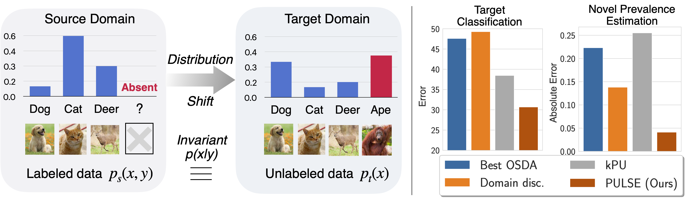

# Domain Adaptation under Open Set Label Shift

This repository is the official implementation of [Domain Adaptation under Open Set Label Shift](). We also release implementation of relevant baselines for Open Set Domain Adaptation and alternative methods adapted from PU learning. 
If you find this repository useful or use this code in your research, please cite the following paper: 

> Garg, S., Balakrishnan, S., Lipton, Z. (2022). Domain Adaptation under Open Set Label Shift. arxiv preprint  arXiv:xxxx.xxxxx. 
```
@article{garg2022OSLS,
    title={Domain Adaptation under Open Set Label Shift},
    author={Garg, Saurabh and Balakrishnan, Sivaraman and Lipton, Zachary},
    year={2022},
    journal={arXiv preprint arXiv:xxxx.xxxxx}, 
}
```
### Setup and Aggregated Results



## Requirements

The code is written in Python and uses [PyTorch](https://pytorch.org/). To install requirements, setup a conda enviornment using the following command:

```setup
conda create --file enviornment.yml
```

## Setup 

For dataset setup, we CIFAR10, CIFAR100 from pytorch torchvision library.  For other datasets follow the details provided in the paper. 

For pretrained models, download and store the following files in the folder `./pretrained_models/`: For CIFAR100 we use the pretrained models provided [here](https://drive.google.com/file/d/1huW-ChBVvKcx7t8HyDaWTQB5Li1Fht9x/view) and for entity30 we use the pretrained models provided [here](https://github.com/AndrewAtanov/simclr-pytorch). For newsgroups20, we use glove vectors from [here](hhttps://www.kaggle.com/datasets/danielwillgeorge/glove6b100dtxt).


## Quick Experiments 

`run.py` file is the main entry point for training the model and run the code with the following command:

```setup
CUDA_VISIBLE_DEVICES=0 python run.py -m models=trainPU_labelshift.yaml datamodule=random_split_module.yaml seed=42 dataset=breakhis arch=Resnet50 num_source_classes=6 fraction_ood_class=0.25 max_epochs=80 batch_size=32 pretrained=True learning_rate=0.0001 separate=True datamodule.seed=1
```

Change the parameters to your liking and run the experiment. For example, change dataset by changing dataset to one of `[CIFAR10, CIFAR100, entity30, breakhis, dermnet, tabula_munis, newsgroups20]` and vary algorithm with varying models to any yaml file in `configs/models`. We implement our PULSE framework in `src/algorithm/trainPU_labelshift.py`.

## Scripts 
We provide a set of scripts to run the main experiments. See scripts folder for details. 

We provide code to aggregate and plot results in `aggregate_nums.py`, `plot_acc.py` and `plot_mpe.py`. 


## License
This repository is licensed under the terms of the [Apache-2.0 License](LICENSE).

## More information
The code uses hydra to manage config files and pytorch lightening to manage training. Algorithm specific config files 
are in `configs/models` folder. We use random datamodule `configs/datamodule/random_split_module.yaml` to generate an OSLS setup.

## Questions?

For more details, refer to the accompanying the paper: [Domain Adaptation under Open Set Label Shift](). If you have questions, please feel free to reach us at sgarg2@andrew.cmu.edu or open an issue.  
